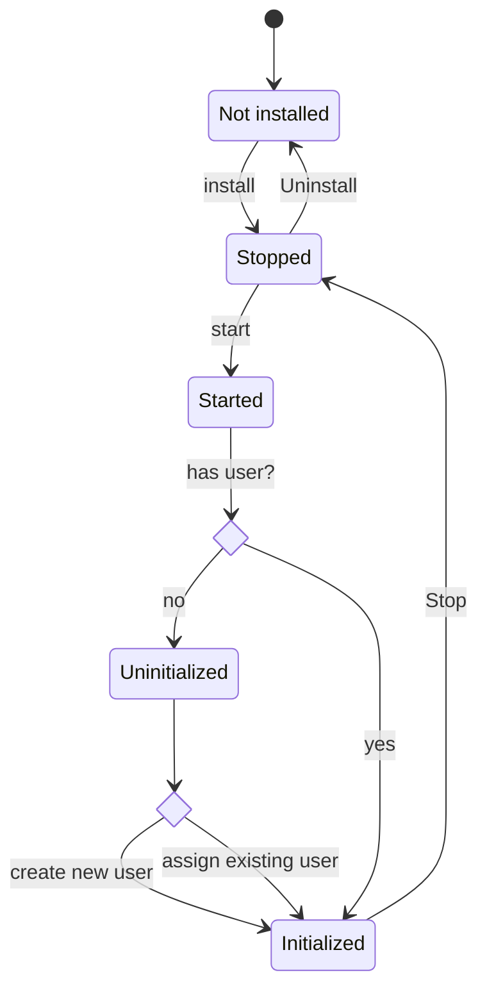

# Mobile state

```mermaid
stateDiagram-v2
    NotInstalled: Not installed
    [*] --> NotInstalled
    NotInstalled --> Stopped: install
    Stopped --> Started: start
    state initial_check <<choice>>
    Started --> initial_check: has user?
    initial_check --> Uninitialized: no
    state setup_type <<choice>>
    Uninitialized --> setup_type
    setup_type --> Initialized: create new user
    setup_type --> Initialized: assign existing user
    initial_check --> Initialized: yes
    Stopped --> NotInstalled: Uninstall
    Initialized --> Stopped: Stop
```
