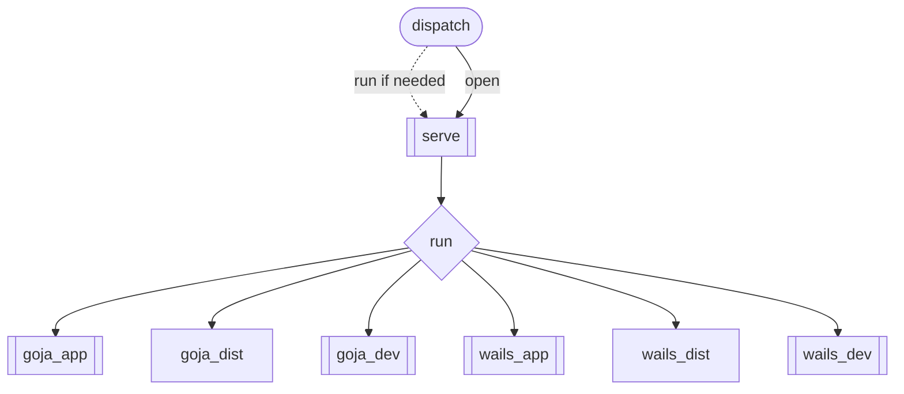

```mermaid
flowchart


    dispatch -. run if needed .-> serve
    dispatch -- open --> serve
    serve --> run
    run --> goja_app
    run --> goja_dist
    run --> goja_dev
    run --> wails_app
    run --> wails_dist
    run --> wails_dev
    
    dispatch([dispatch])
    serve[[serve]]
    run{run}
    goja_app[[goja_app]]
    goja_dev[[goja_dist]]
    goja_dev[[goja_dev]]
    wails_app[[wails_app]]
    wails_dev[[wails_dist]]
    wails_dev[[wails_dev]]
```