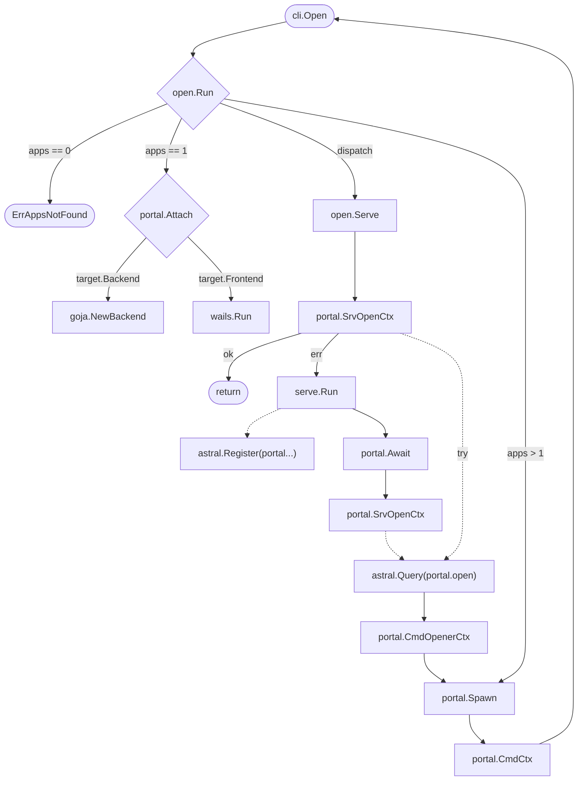

```mermaid
flowchart
    cli.Open --> open.Run
    open.Run -- apps == 0 --> ErrAppsNotFound
    open.Run -- apps == 1 --> portal.Attach
    open.Run -- dispatch --> open.Serve
    open.Run -- apps > 1 --> portal.Spawn

    portal.SrvOpenCtx -- ok --> return
    open.Serve --> portal.SrvOpenCtx
    serve.Run -.-> register.portal
    serve.Run --> portal.Await
    portal.SrvOpenCtx -- err --> serve.Run
    portal.SrvOpenCtx -.try.-> portal.open
    portal.Await --> portal.SrvOpenCtx2
    portal.SrvOpenCtx2 -.-> portal.open

    portal.Attach -- target.Backend --> goja.NewBackend
    portal.Attach -- target.Frontend --> wails.Run

    portal.Spawn --> portal.CmdCtx
    portal.CmdCtx --> cli.Open
    
    portal.open --> portal.CmdOpenerCtx
    portal.CmdOpenerCtx --> portal.Spawn

    cli.Open([cli.Open])
    open.Run{open.Run}
    ErrAppsNotFound([ErrAppsNotFound])
    portal.Attach{portal.Attach}
    portal.SrvOpenCtx[portal.SrvOpenCtx]
    return([return])
    register.portal["astral.Register(portal...)"]
    portal.open["astral.Query(portal.open)"]
    portal.SrvOpenCtx2[portal.SrvOpenCtx]
```