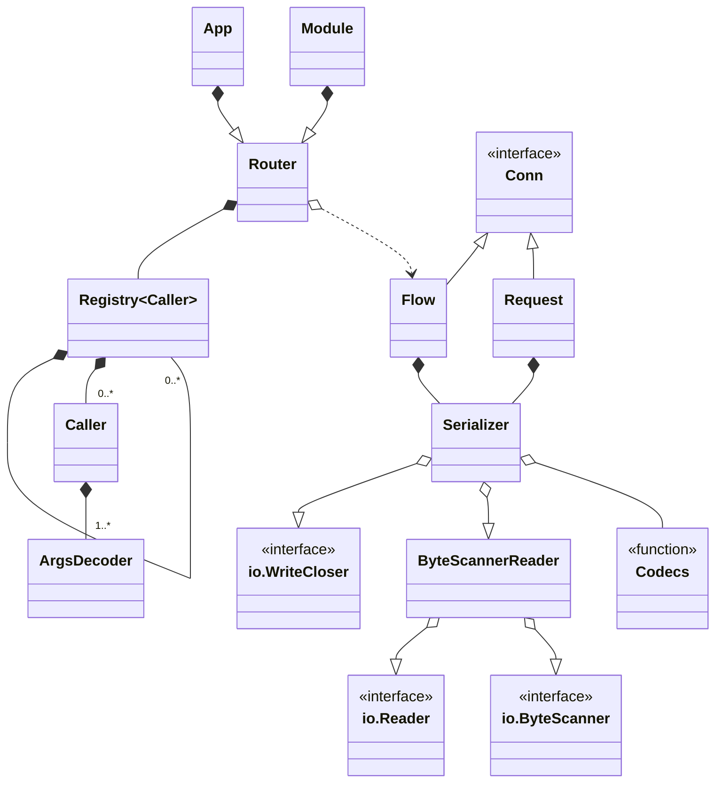

class

```mermaid
classDiagram
    class App
    class Module
    class Router
    class Registry~Caller~
    class Flow
    class Serializer
    class Conn
    <<interface>> Conn
    class ByteScanner["io.ByteScanner"]
    <<interface>> ByteScanner
    class Reader["io.Reader"]
    <<interface>> Reader
    class WriteCloser["io.WriteCloser"]
    <<interface>> WriteCloser
    class Codecs
    <<function>> Codecs
    
    
    App *--|> Router
    Module *--|> Router
    Router *-- Registry
    Registry *-- "0..*" Registry
    Registry *-- "0..*" Caller
    Caller *-- "1..*" ArgsDecoder
    Router o..> Flow
    Conn <|-- Flow
    Conn <|-- Request
    Flow *-- Serializer
    Request *-- Serializer
    Serializer o--|> WriteCloser 

    Serializer o--|> ByteScannerReader
    ByteScannerReader o--|> Reader
    ByteScannerReader o--|> ByteScanner
    Serializer o-- Codecs
```
